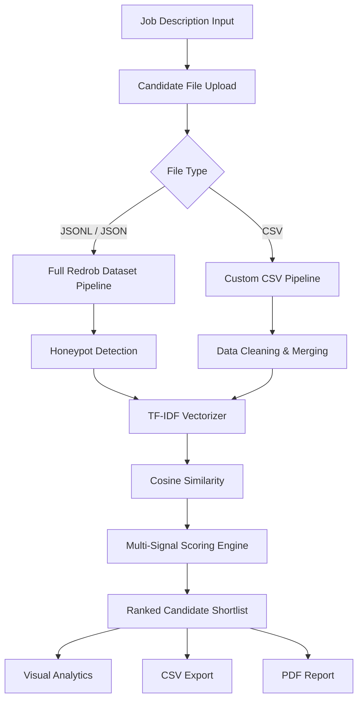

<div align="center">


# 🏆 Intelligent Candidate Discovery

### AI-powered recruitment system that ranks the best candidates, removes fake profiles, and gives recruiter-ready insights in seconds.

<br/>

<a href="https://intelligent-candidate-discovery-ey8bkkwuov7b5g7gmafk7x.streamlit.app">
  
</a>
<a href="https://youtu.be/RBYdjJrNFyY">
  
</a>
<a href="https://colab.research.google.com/drive/1p6pRJsb7AZ3lAqxFGtQ4rhTzefDwyCBL?usp=sharing">
  
</a>
<a href="https://github.com/irfanshafi21">
  
</a>

<br/><br/>


</div>

---

## ⭐ Judge Summary

**Intelligent Candidate Discovery** solves one of the biggest hiring problems: recruiters receive hundreds or thousands of profiles, but traditional keyword filters miss strong candidates and allow fake profiles to enter the shortlist.

This system uses **NLP-based semantic matching**, **honeypot detection**, and a **multi-signal scoring engine** to rank candidates accurately and instantly.

| What It Does | Why It Matters |
|---|---|
| 🎯 Ranks candidates using JD similarity | Finds talent beyond simple keyword matching |
| 🚫 Detects fake / irrelevant profiles | Removes noise before ranking starts |
| ⚡ Processes 1000+ candidates quickly | Saves recruiter screening time |
| 📊 Shows visual analytics | Helps recruiters make faster decisions |
| 📂 Supports JSONL, JSON, and CSV | Works with real datasets and custom files |
| 📥 Exports CSV and PDF reports | Makes results submission-ready |

---

## 🧩 Problem Statement

Recruiters often spend hours manually screening applications. Existing systems usually depend on rigid keyword filters, which creates three major problems:

- Good candidates are missed because their wording is different from the job description.
- Fake or irrelevant profiles can still appear in the shortlist.
- Recruiters do not get clear ranking explanations or visual insights.

> **Goal:** Build an intelligent candidate discovery engine that can understand job requirements, rank candidates fairly, remove fake profiles, and generate recruiter-ready outputs.

---

## 💡 Proposed Solution

The system accepts a **Job Description** and candidate files, then performs:

1. **Honeypot Detection** — removes fake or irrelevant profiles.
2. **TF-IDF Vectorization** — converts job descriptions and candidate skills into vectors.
3. **Cosine Similarity Matching** — measures how closely each candidate matches the JD.
4. **Multi-Signal Scoring** — combines skill match, experience, activity, education, and assessment signals.
5. **Ranked Output Generation** — displays the best candidates with scores, analytics, CSV export, and PDF report.

---

## 🏗️ System Architecture



---

## 🚀 Key Features

| Feature | Description |
|---|---|
| 🤖 NLP Candidate Ranking | Uses TF-IDF and cosine similarity to match candidates with the job description |
| 🚫 Honeypot Radar | Automatically detects fake, irrelevant, and skill-stuffed profiles |
| ⚖️ Weighted Scoring | Combines skill match, experience, activity, education, and assessments |
| 📂 Unified Upload | Supports JSONL, JSON, CSV, and multi-file uploads |
| 📊 Visual Dashboard | Shows top candidates, score distribution, and skill-experience insights |
| 🎛️ Adjustable Weights | Recruiters can tune skill, experience, and activity weights |
| 📥 Export System | Generates full CSV, top-100 CSV, and PDF reports |
| 🌐 Live Deployment | Streamlit app is accessible directly from the browser |

---

## 🧠 Scoring Model

### JSONL Mode — 7-Signal Composite Score

```python
Final_Score = (Cosine_Similarity * 0.25) \
            + (ML_Skill_Depth  * 0.25) \
            + (ML_Experience   * 0.15) \
            + (Activity_Score  * 0.15) \
            + (Total_Exp       * 0.10) \
            + (Education       * 0.05) \
            + (Assessments     * 0.05)
```

### CSV Mode — Recruiter-Tunable Score

```python
Final_Score = (Skill_Match * skill_weight / 100) \
            + (Experience  * exp_weight   / 100) \
            + (Activity    * act_weight   / 100)
```

---

## 🚫 Honeypot Detection

The system includes a dedicated fake-profile radar before scoring begins.

| Rule | Detection Logic | Result |
|---|---|---|
| Rule 1 | Non-ML job title with very low ML skill/career evidence | Removed as irrelevant |
| Rule 2 | Too many ML skills but no real ML career evidence | Removed as skill-stuffed profile |

This prevents fake candidates from receiving high scores just because they added many keywords.

---

## 📊 Results at a Glance

| Metric | Result |
|---|---:|
| Candidates Ranked | 1000+ |
| Processing Speed | Under 5 seconds |
| Supported Formats | JSONL, JSON, CSV |
| Export Formats | Full CSV, Top-100 CSV, PDF |
| Ranking Method | NLP + Multi-signal scoring |
| Fake Profile Handling | Automatic honeypot removal |
| Deployment | Streamlit Cloud |

---

## 🖼️ Screenshots

> Add your project screenshots inside an `assets/` folder and rename them as below.

```md


```

---

## 🛠️ Tech Stack

| Technology | Purpose |
|---|---|
| Python | Core programming language |
| Streamlit | Web application and deployment |
| pandas | Dataset loading and processing |
| NumPy | Numerical scoring operations |
| scikit-learn | TF-IDF vectorization and cosine similarity |
| Matplotlib | Charts and PDF visualizations |

---

## 📂 Supported Input Formats

### JSONL / JSON

Used for the full Redrob-style dataset pipeline.

```json
{
  "candidate_id": "C001",
  "profile": {
    "anonymized_name": "Candidate_1",
    "current_title": "ML Engineer",
    "years_of_experience": 5
  },
  "skills": [
    { "name": "Python", "proficiency": "advanced", "endorsements": 12 }
  ],
  "career_history": [
    { "title": "ML Engineer", "duration_months": 24 }
  ],
  "redrob_signals": {
    "github_activity_score": 82,
    "profile_completeness_score": 90,
    "verified_email": true
  }
}
```

### CSV

| Column | Description | Example |
|---|---|---|
| name | Candidate name | Rahul Sharma |
| skills | Candidate skills | Python TensorFlow NLP |
| experience_years | Years of experience | 4 |
| job_title | Current role | ML Engineer |
| activity_score | Activity score | 85 |
| education | Highest education | M.Tech CS |

---

## ▶️ How to Run

### Option 1 — Live Demo

Open the deployed Streamlit app:

```text
https://intelligent-candidate-discovery-ey8bkkwuov7b5g7gmafk7x.streamlit.app
```

### Option 2 — Google Colab

Open the notebook from the badge above and run all cells.

### Option 3 — Run Locally

```bash
git clone https://github.com/irfanshafi21/intelligent-candidate-discovery.git
cd intelligent-candidate-discovery
pip install -r requirements.txt
streamlit run app.py
```

---

## 📁 Repository Structure

```text
intelligent-candidate-discovery/
│
├── app.py                              # Main Streamlit app
├── candidates.csv                      # Sample candidate dataset
├── candidates_file1.csv                # Multi-upload demo file
├── ranked_candidates.csv               # Full ranked output
├── submission.csv                      # Top-100 submission file
├── ranked_candidates_report.pdf        # Generated PDF report
├── Intelligent-Candidate-Discovery-System.pdf
├── requirements.txt                    # Python dependencies
└── assets/                             # Screenshots and demo images
```

---

## 🏆 Why This Project Can Win

| Judging Area | How This Project Delivers |
|---|---|
| Real-world relevance | Solves a practical hiring problem faced by recruiters |
| Innovation | Combines semantic matching with fake profile detection |
| AI usage | Uses NLP, vectorization, similarity scoring, and multi-signal ranking |
| Usability | Simple Streamlit UI with upload, ranking, analytics, and export |
| Scalability | Handles 1000+ candidates and multiple file formats |
| Presentation | Live demo, demo video, Colab notebook, CSV output, and PDF report |

---

## 📋 Submission Checklist

- [x] Working Streamlit web app
- [x] Live demo link
- [x] Demo video
- [x] Google Colab notebook
- [x] Clean GitHub repository
- [x] Ranked output CSV
- [x] Top-100 submission CSV
- [x] PDF report
- [x] Pitch deck

---

<div align="center">

## 🇮🇳 Built for Smarter Hiring in India

### Make hiring faster. Make ranking fairer. Make talent discovery intelligent.

<br/>

**India Runs Hackathon 2026 · Track 01 · Data & AI Challenge**

<br/>

Made with ❤️ by **Mohamed Irfan Shafi**

<br/>


</div>
