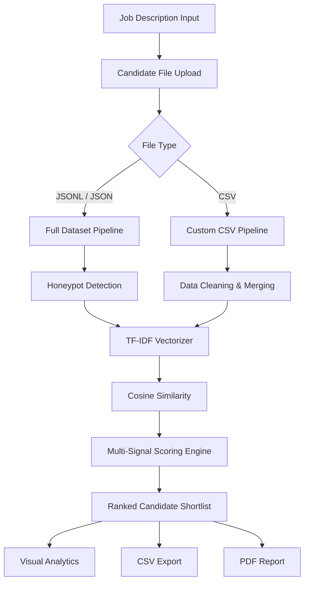

<div align="center">


# INTELLIGENT CANDIDATE DISCOVERY

<sub>AI-Powered Candidate Ranking & Honeypot Detection</sub>

<br>


<br><br>

[](https://intelligent-candidate-discovery-ey8bkkwuov7b5g7gmafk7x.streamlit.app)
[](https://youtu.be/RBYdjJrNFyY)
[](https://colab.research.google.com/drive/1p6pRJsb7AZ3lAqxFGtQ4rhTzefDwyCBL?usp=sharing)
[](https://github.com/irfanshafi21)

<br>


</div>

<br>

## 👤 Overview

**Intelligent Candidate Discovery** solves one of the biggest hiring problems: recruiters receive hundreds or thousands of profiles, but traditional keyword filters miss strong candidates and allow fake profiles into the shortlist.

This system uses **NLP-based semantic matching**, **honeypot detection**, and a **multi-signal scoring engine** to rank candidates accurately and instantly.

| What It Does | Why It Matters |
|---|---|
| 🎯 Ranks candidates using JD similarity | Finds talent beyond simple keyword matching |
| 🚫 Detects fake / irrelevant profiles | Removes noise before ranking starts |
| ⚡ Processes 1000+ candidates quickly | Saves recruiter screening time |
| 📊 Shows visual analytics | Helps recruiters make faster decisions |
| 📂 Supports JSONL, JSON, and CSV | Works with real datasets and custom files |
| 📥 Exports CSV and PDF reports | Recruiter-ready, shareable output |

<br>

## 🧩 Problem Statement

Recruiters often spend hours manually screening applications. Existing systems usually depend on rigid keyword filters, which creates three major problems:

- Good candidates are missed because their wording differs from the job description.
- Fake or irrelevant profiles can still appear in the shortlist.
- Recruiters don't get clear ranking explanations or visual insights.

> **Goal:** Build an intelligent candidate discovery engine that understands job requirements, ranks candidates fairly, removes fake profiles, and generates recruiter-ready outputs.

<br>

## 💡 Proposed Solution

The system accepts a **Job Description** and candidate files, then performs:

1. **Honeypot Detection** — removes fake or irrelevant profiles.
2. **TF-IDF Vectorization** — converts job descriptions and candidate skills into vectors.
3. **Cosine Similarity Matching** — measures how closely each candidate matches the JD.
4. **Multi-Signal Scoring** — combines skill match, experience, activity, education, and assessment signals.
5. **Ranked Output Generation** — displays the best candidates with scores, analytics, CSV export, and PDF report.

<br>

## 🏗️ System Architecture


```mermaid
flowchart TD
    A[Job Description Input] --> B[Candidate File Upload]
    B --> C{File Type}
    C -->|JSONL / JSON| D[Full Dataset Pipeline]
    C -->|CSV| E[Custom CSV Pipeline]
    D --> F[Honeypot Detection]
    E --> G[Data Cleaning & Merging]
    F --> H[TF-IDF Vectorizer]
    G --> H
    H --> I[Cosine Similarity]
    I --> J[Multi-Signal Scoring Engine]
    J --> K[Ranked Candidate Shortlist]
    K --> L[Visual Analytics]
    K --> M[CSV Export]
    K --> N[PDF Report]
```

<br>

## 🚀 Key Features

| Feature | Description |
|---|---|
| 🤖 NLP Candidate Ranking | Uses TF-IDF and cosine similarity to match candidates with the job description |
| 🚫 Honeypot Radar | Automatically detects fake, irrelevant, and skill-stuffed profiles |
| ⚖️ Weighted Scoring | Combines skill match, experience, activity, education, and assessments |
| 📂 Unified Upload | Supports JSONL, JSON, CSV, and multi-file uploads |
| 📊 Visual Dashboard | Shows top candidates, score distribution, and skill-experience insights |
| 🎛️ Adjustable Weights | Recruiters can tune skill, experience, and activity weights |
| 📥 Export System | Generates full CSV, top-100 CSV, and PDF reports |
| 🌐 Live Deployment | Streamlit app accessible directly from the browser |

<br>

## 🧠 Scoring Model

**JSONL Mode — 7-Signal Composite Score**

```python
Final_Score = (Cosine_Similarity * 0.25) \
            + (ML_Skill_Depth  * 0.25) \
            + (ML_Experience   * 0.15) \
            + (Activity_Score  * 0.15) \
            + (Total_Exp       * 0.10) \
            + (Education       * 0.05) \
            + (Assessments     * 0.05)
```

**CSV Mode — Recruiter-Tunable Score**

```python
Final_Score = (Skill_Match * skill_weight / 100) \
            + (Experience  * exp_weight   / 100) \
            + (Activity    * act_weight   / 100)
```

<br>

## 🚫 Honeypot Detection

A dedicated fake-profile radar runs before scoring begins.

| Rule | Detection Logic | Result |
|---|---|---|
| Rule 1 | Non-ML job title with very low ML skill/career evidence | Removed as irrelevant |
| Rule 2 | Too many ML skills but no real ML career evidence | Removed as skill-stuffed profile |

This prevents fake candidates from receiving high scores just because they added many keywords.

<br>

## 📊 Results at a Glance

| Metric | Result |
|---|---:|
| Candidates Ranked | 1000+ |
| Processing Speed | Under 5 seconds |
| Supported Formats | JSONL, JSON, CSV |
| Export Formats | Full CSV, Top-100 CSV, PDF |
| Ranking Method | NLP + Multi-signal scoring |
| Fake Profile Handling | Automatic honeypot removal |
| Deployment | Streamlit Cloud |

<br>

## 🖼️ Screenshots

> Add your project screenshots inside an `assets/` folder and rename them as below.

```md


```

<br>

## 🛠️ Tech Stack

| Technology | Purpose |
|---|---|
| Python | Core programming language |
| Streamlit | Web application and deployment |
| pandas | Dataset loading and processing |
| NumPy | Numerical scoring operations |
| scikit-learn | TF-IDF vectorization and cosine similarity |
| Matplotlib | Charts and PDF visualizations |

<p align="center">

</p>

<br>

## 📂 Supported Input Formats

**JSONL / JSON** — used for the full dataset pipeline.

```json
{
  "candidate_id": "C001",
  "profile": {
    "anonymized_name": "Candidate_1",
    "current_title": "ML Engineer",
    "years_of_experience": 5
  },
  "skills": [
    { "name": "Python", "proficiency": "advanced", "endorsements": 12 }
  ],
  "career_history": [
    { "title": "ML Engineer", "duration_months": 24 }
  ],
  "signals": {
    "github_activity_score": 82,
    "profile_completeness_score": 90,
    "verified_email": true
  }
}
```

**CSV**

| Column | Description | Example |
|---|---|---|
| name | Candidate name | Rahul Sharma |
| skills | Candidate skills | Python TensorFlow NLP |
| experience_years | Years of experience | 4 |
| job_title | Current role | ML Engineer |
| activity_score | Activity score | 85 |
| education | Highest education | M.Tech CS |

<br>

## ▶️ How to Run

**Option 1 — Live Demo**

```text
https://intelligent-candidate-discovery-ey8bkkwuov7b5g7gmafk7x.streamlit.app
```

**Option 2 — Google Colab**

Open the notebook from the badge above and run all cells.

**Option 3 — Run Locally**

```bash
git clone https://github.com/irfanshafi21/intelligent-candidate-discovery.git
cd intelligent-candidate-discovery
pip install -r requirements.txt
streamlit run app.py
```

<br>

## 📁 Repository Structure

```text
intelligent-candidate-discovery/
│
├── app.py                              # Main Streamlit app
├── candidates.csv                      # Sample candidate dataset
├── candidates_file1.csv                # Multi-upload demo file
├── ranked_candidates.csv               # Full ranked output
├── submission.csv                      # Top-100 submission file
├── ranked_candidates_report.pdf        # Generated PDF report
├── requirements.txt                    # Python dependencies
└── assets/                             # Screenshots and demo images
```

<br>

## 🎯 Currently

```
📚 Focus        : NLP-based ranking, honeypot detection, scoring design
🔭 Building     : Intelligent Candidate Discovery
🌐 Live App     : https://intelligent-candidate-discovery-ey8bkkwuov7b5g7gmafk7x.streamlit.app
🤝 Open to      : Feedback, collaborations, contributions
📫 Reach me     : irfanshafi210608@gmail.com
```

<br>

<div align="center">


<sub>Made with by Mohamed Irfan Shafi</sub>

</div>
